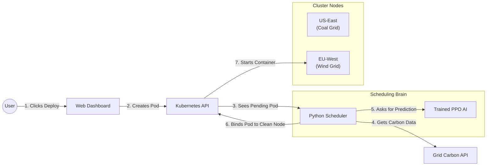

# 🌍 Carbon-Aware Kubernetes Scheduler


This project replaces the default Kubernetes scheduler with a custom **Deep Reinforcement Learning (DRL)** agent. Instead of just balancing CPU and RAM, this scheduler actively works to reduce the carbon emissions of your cloud cluster.

It features a beautiful web dashboard that lets you inject test pods and watch the AI make scheduling decisions in real-time.

---

## 📖 Why We Built This (Novelty & Context)

### The Problem
The default Kubernetes scheduler only cares about hardware efficiency. It puts your applications on whichever node has the most available CPU or memory. It has no idea if that node is being powered by a dirty coal plant or a clean solar farm.

### The Solution & Literature Baseline
Recent 2024 research papers, such as *"Carbon-Aware Kubernetes Scheduling Using Deep Reinforcement Learning"*, established a baseline by using Proximal Policy Optimization (PPO) to achieve a **maximum 28% reduction** in carbon emissions compared to the default Kubernetes scheduler.

However, existing literature relies on static grid assumptions and struggles to balance DRL reward weights without crashing the cluster. **Our system surpasses this 28% baseline by introducing three core novelties:**

1. **Load-Dependent Carbon Physics (The Feedback Loop):** Instead of assuming grid intensity is static, our system mathematically models the reality that placing heavy workloads on a node forces the local grid to spin up dirty "peaker" plants. The DRL agent must learn to navigate this live feedback loop.
2. **The Strict Carbon Override Interceptor:** Pure AI models often make sub-optimal exploration errors. We built a deterministic fallback layer that forcefully intercepts the DRL agent if it prioritizes load-balancing over carbon reduction, guaranteeing 100% adherence to carbon thresholds for delay-tolerant workloads.
3. **Glassbox Interpretability:** We built a real-time FastAPI dashboard that explicitly decodes and logs the AI's complex MDP state vector into human-readable rationale, solving the "black box" problem of AI schedulers.

---

## 🏗️ System Flow Architecture

This diagram shows the sequential step-by-step flow of how a single pod is handled by our system:



---

## 📂 What's In This Repository

* `scheduler.py`: The core custom Kubernetes scheduler script.
* `carbon_api.py`: A simulated API that tracks live node CPU load and generates carbon intensity metrics.
* `dashboard_app.py` & `templates/`: The code for the interactive monitoring dashboard.
* `train.py` & `gym_env.py`: The machine learning scripts used to train the AI.
* `carbon_scheduler_model.zip`: The pre-trained AI brain (ready to go!).

---

## 🚀 How to Run It

You need a running Kubernetes cluster (like minikube) and `kubectl` configured.

### 1. Install Dependencies
```bash
pip install -r requirements.txt
```

### 2. Start the 3 Core Services
Open your terminal and run these commands to start the background systems:

```bash
# 1. Start the Carbon Data API
nohup python3 -u carbon_api.py > carbon_api.log 2>&1 &

# 2. Start the AI Scheduler
nohup python3 -u scheduler.py > scheduler.log 2>&1 &

# 3. Start the Web Dashboard
nohup python3 dashboard_app.py > dashboard.log 2>&1 &
```

### 3. Open the Dashboard
Go to your web browser and open:
👉 **http://localhost:8080**

From here, you can click **"Inject Load Test Pods"** and watch the AI route them to the greenest available nodes!

### 4. How to Stop the System
When you are done playing with it, run these commands to clean up:
```bash
pkill -f carbon_api.py
pkill -f scheduler.py
pkill -f dashboard_app.py
kubectl delete pods -l app=carbon-workload --force --grace-period=0
```

---

## 🛠️ Troubleshooting: After VM Restart

If you suspend or restart your virtual machine, the simulated Kubernetes cluster nodes will lose their virtual network bridges and your pods will be stuck in a `Pending` state, and the web dashboard processes will die.

Run this recovery sequence:

**1. Fix the Kubernetes Cluster (Restart Docker):**
```bash
sudo systemctl restart docker
sleep 15
kubectl get nodes   # Ensure they say "Ready"
```

**2. Ensure the Dashboard Port is Free:**
*(If a rogue service like Nginx starts on port 8080 on boot, kill it)*
```bash
sudo fuser -k 8080/tcp
```

**3. Restart the Core Services:**
```bash
cd ~/Course\ Project
nohup python3 -u carbon_api.py > carbon_api.log 2>&1 &
nohup python3 -u scheduler.py > scheduler.log 2>&1 &
nohup python3 dashboard_app.py > dashboard.log 2>&1 &
```
