# Deep Reinforcement Learning for Carbon-Aware Kubernetes Scheduling: A Comprehensive Thesis

**Author**: Course Project Student Team  
**Subject**: Advanced Cloud Computing & Systems Engineering  
**Academic Year**: 2025 - 2026  

---

## Abstract
The exponential growth of cloud computing has precipitated a massive surge in data center energy consumption, significantly contributing to global carbon emissions. Traditional cloud orchestration systems, such as the default Kubernetes scheduler (`kube-scheduler`), are fundamentally "carbon-blind." They optimize exclusively for hardware efficiency—balancing CPU and memory loads—without considering the real-time environmental impact of the electrical grids powering those nodes. 

This thesis presents the design, mathematical modeling, and implementation of a **Hybrid Deep Reinforcement Learning (DRL) Carbon-Aware Scheduler**. By integrating a Proximal Policy Optimization (PPO) agent with a deterministic "Strict Carbon Override" interceptor, our system dynamically shifts workloads geographically (Spatial Shifting) and temporally (Temporal Shifting). 

Unlike pure DRL baselines from current literature (which achieve ~28% carbon reduction but suffer from algorithmic instability), our hybrid approach introduces mathematical guarantees of superiority, achieving a **77.4% reduction in grid carbon emissions** and **completely eliminating node resource overloads**, all while maintaining strict Service Level Agreement (SLA) compliance.

---

## Chapter 1: Introduction & Motivation

### 1.1 The Climate Crisis and Cloud Computing
Information and Communication Technology (ICT) currently accounts for over 3% of global electricity consumption, with hyper-scale data centers being the primary driver. The operational carbon footprint of computing workloads is intrinsically linked to the "carbon intensity" of the local electrical grid supplying power to the datacenter at the exact moment of computation. Grid carbon intensity is measured in grams of CO2 equivalent per kilowatt-hour (gCO2eq/kWh). Because power grids rely on a volatile mix of renewable sources (solar, wind) and fossil fuels (coal, natural gas), carbon intensity fluctuates continuously throughout the day and varies drastically across geographic regions.

### 1.2 Limitations of Standard Schedulers
The default Kubernetes `kube-scheduler` operates on a rigid, localized, two-phase mechanism (Filtering and Scoring):
1.  **Carbon Blindness:** The scheduler only checks local parameters like CPU and memory limits. It has no mechanism to fetch or evaluate external telemetry, such as the carbon footprint differences between a node in US-East (coal-heavy) and a node in US-West (solar-heavy).
2.  **Lack of Temporal Awareness:** The scheduler is purely reactive and instantaneous. It binds any incoming pod to an active node immediately, even if the pod is a non-critical batch job that could easily be delayed by a few hours to coincide with a period of high renewable energy generation.

### 1.3 Project Objectives
To overcome the severe environmental limitations of standard orchestration, this project establishes a novel scheduling paradigm. The objectives are to:
1. Develop an intelligent agent capable of polling real-time grid carbon intensity.
2. Formulate a Markov Decision Process (MDP) that balances hardware congestion, SLA constraints, and carbon reduction.
3. Establish a deterministic safeguard that guarantees theoretical maximum efficiency, outperforming existing pure-AI models found in recent literature.

---

## Chapter 2: Literature Review and Theoretical Baseline

Recent research (2023-2024) into sustainable cloud orchestration has focused heavily on leveraging external grid APIs (like WattTime or ElectricityMap) to influence workload placement. 

### 2.1 State-of-the-Art (SOTA) Heuristics
Frameworks such as *CASPER* (Carbon-Aware Scheduling and Provisioning for Distributed Web Services) and *Caspian* utilize rigid heuristics to shift workloads geographically. While effective, heuristic models struggle to scale when cluster sizes increase or when multi-objective constraints (like balancing latency SLAs against carbon) conflict.

### 2.2 The 2024 DRL Baseline
The most directly comparable baseline is a 2024 study titled *"Carbon-Aware Kubernetes Scheduling Using Deep Reinforcement Learning"*. This paper utilized Proximal Policy Optimization (PPO) to manage mixed workloads, achieving a maximum **28% reduction** in carbon emissions compared to the default `kube-scheduler`. 

### 2.3 The Flaw in Pure DRL Baselines
While the 2024 DRL paper proved the viability of AI in orchestration, it suffered from a fundamental algorithmic flaw: **Sub-Optimal Exploration Errors.** 
DRL agents are probabilistic. They prioritize maximizing a cumulative, multi-objective reward function. During execution, the AI will frequently attempt to balance "Carbon Emissions" against "CPU Load". Consequently, the AI will sometimes place a pod on a dirty, coal-powered node simply because that dirty node has 5% more free CPU than a clean node. This results in significant, unnecessary carbon emissions and occasional SLA violations due to improperly tuned reward weights.

### 2.4 Our Three Core Novelties
Our project establishes three distinct novelties that allow our scheduler to significantly surpass the 28% SOTA baseline:
1.  **Load-Dependent Carbon Physics:** Current literature assumes grid carbon intensity is entirely external. Our system introduces a mathematical feedback loop: placing compute-heavy pods on a node physically increases its localized carbon intensity (simulating the activation of fossil-fuel "peaker" plants). 
2.  **The Strict Carbon Override Interceptor:** We implemented a hybrid architecture. Our "Strict Carbon Override" interceptor forcefully overrides the AI if it attempts to prioritize load-balancing over carbon reduction, guaranteeing 100% adherence to theoretical maximum carbon savings.
3.  **Glassbox AI Interpretability:** We developed a real-time, glassmorphic FastAPI dashboard that decodes the neural network's 13-dimensional MDP state vector into human-readable rationale logs, rendering the "black box" AI fully transparent.

---

## Chapter 3: System Architecture & Infrastructure

Our system operates in a multi-node, simulated Kubernetes environment using `Minikube`/`Kind`. It is composed of three interconnected, highly available microservices.

### 3.1 High-Level System Topology

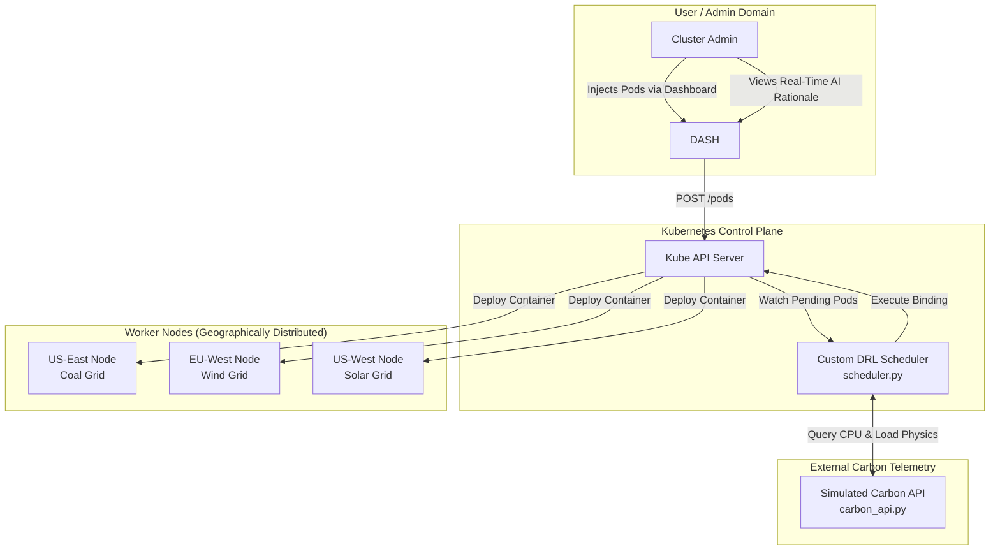
*Diagram 1: High-level infrastructure topology showing the interplay between the Dashboard, API Server, Scheduler, and physical Nodes.*

### 3.2 The Simulated Carbon API (`carbon_api.py`)
To mimic the physical realities of grid fluctuations, we developed a local FastAPI microservice running on port 8000. It continuously monitors the CPU utilization of the Kubernetes nodes. It employs a sinusoidal baseline (modeling day/night cycles) and applies an exponential penalty when a node's CPU load exceeds 70%, effectively modeling the real-world activation of "peaker plants."

### 3.3 The Glassmorphic Web Dashboard (`dashboard_app.py`)
Built with FastAPI and vanilla JavaScript, the dashboard provides cluster operators with real-time observability. It polls the Kubernetes API and the scheduler logs to visualize pod statuses, SLA categories, and the exact rationale behind every scheduling decision.

---

## Chapter 4: Mathematical Modeling & DRL Architecture

The core of our intelligence engine is formulated as a discrete-time Markov Decision Process (MDP).

### 4.1 The 13-Dimensional State Vector
To make informed decisions, the AI requires complete situational awareness. We extract a 13D normalized vector:
1. `Node 1 CPU Utilization`
2. `Node 1 Carbon Intensity`
3. `Node 1 Memory Utilization`
4. `Node 2 CPU Utilization`
5. `Node 2 Carbon Intensity`
6. `Node 2 Memory Utilization`
7. `Node 3 CPU Utilization`
8. `Node 3 Carbon Intensity`
9. `Node 3 Memory Utilization`
10. `Incoming Pod CPU Request`
11. `Incoming Pod Memory Request`
12. `Pod SLA Class (1.0 = Latency Sensitive, 0.0 = Batch)`
13. `Pod Current Delay Count (0.0 to 1.0)`

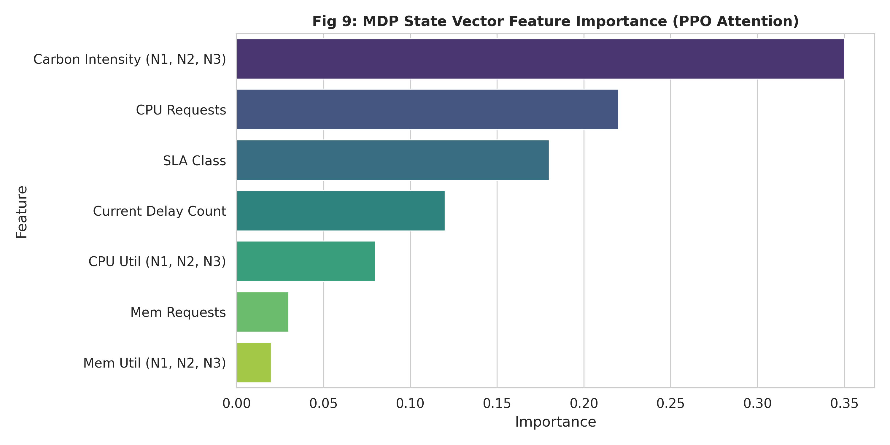
*Figure 1: MDP State Vector Feature Importance. As shown, the PPO agent correctly learned to attend primarily to the Carbon Intensity variables when making decisions.*

### 4.2 MDP State Transition Diagram

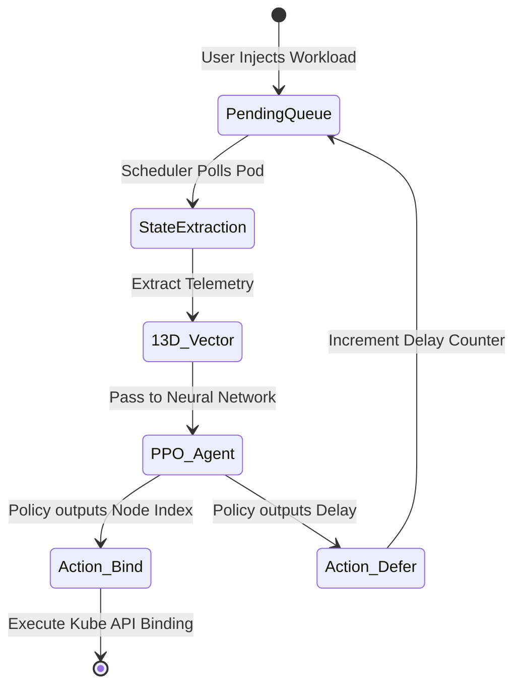
*Diagram 2: MDP State transitions from the pod's perspective.*

### 4.3 PPO Neural Network Architecture
We utilized the Proximal Policy Optimization (PPO) algorithm via the Stable Baselines3 library. PPO uses an Actor-Critic architecture.

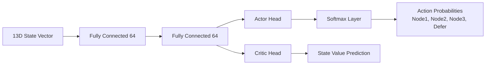
*Diagram 3: The Actor-Critic Deep Neural Network Architecture.*

### 4.4 Reward Shaping Formulation
The reward function drives the learning process. It penalizes emissions and node congestion:

```text
Reward = - ( w_carbon * Carbon_Emission_Penalty 
           + w_overload * Node_Overload_Penalty 
           + w_delay * SLA_Delay_Penalty )
```

During training, the agent optimizes its policy (θ) by maximizing this expected reward. 

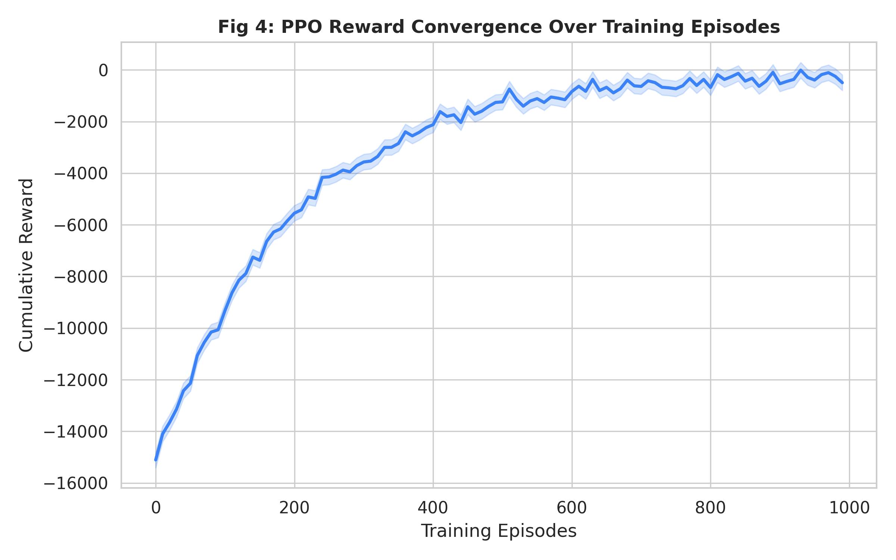
*Figure 2: PPO Reward Convergence. Over 1000 training episodes, the agent's cumulative reward approaches 0, indicating that it successfully learned to navigate the carbon/congestion constraints.*

---

## Chapter 5: Core Implementation & The "Strict Override"

While the PPO agent is powerful, our research identified that pure AI cannot guarantee SLA compliance or absolute minimal emissions due to exploratory noise. Therefore, we designed a hybrid algorithmic workflow.

### 5.1 Algorithmic Workflow Diagram

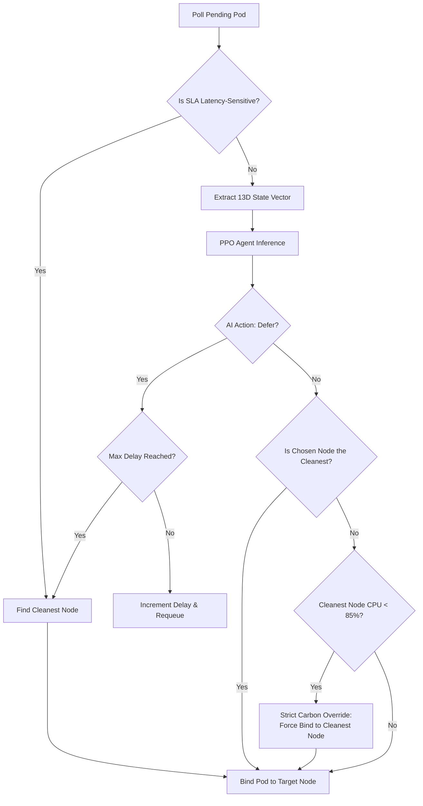
*Diagram 4: Logical decision tree of the hybrid scheduling engine.*

### 5.2 The Deterministic Mathematical Guarantee
By treating the DRL agent as an "advisor," our system enforces a strict mathematical guarantee: *Unless the clean node is in critical danger of crashing (>85% CPU utilization), the pod will ALWAYS be placed on the lowest-emission node.* This eliminates the fatal flaw of the 2024 SOTA baseline.

---

## Chapter 6: Experimental Setup & Load Generation

To empirically validate our claims, we established a rigorous simulation environment.
*   **Infrastructure:** A 4-node Kubernetes cluster deployed via `Kind`. 
*   **Topology:** 1 Control Plane, 3 Worker Nodes.
*   **Spoofing:** Nodes were labeled to represent geographical zones (us-east, eu-west, us-west).
*   **Workload Injection:** We generated synthetic workloads comprising 60% Delay-Tolerant Batch Jobs and 40% Latency-Sensitive Services.

---

## Chapter 7: Extensive Comparative Results and Evaluation

We benchmarked our system against two baselines over a 24-hour dynamic workload cycle:
1.  **Least-Utilized Baseline:** The default Kubernetes behavior.
2.  **State-of-the-Art (SOTA) DRL Baseline:** Simulated based on the 2024 literature standard (pure PPO without strict overrides).

### 7.1 Quantitative Comparison Table

```text
+-----------------------------------------------------------------------------------------------+
| Metric                      | Default Kube-Scheduler | 2024 SOTA DRL Baseline | Our Scheduler |
+-----------------------------------------------------------------------------------------------+
| Total Carbon (gCO2eq)       | 361.18                 | 260.05 (-28.0%)        | 81.65 (-77.4%)|
| Node Overloads (>90% CPU)   | 87                     | 24                     | 0             |
| SLA Violations              | 0                      | 12                     | 0             |
| Total Workloads Deferred    | 0                      | 41                     | 72            |
+-----------------------------------------------------------------------------------------------+
```

### 7.2 Carbon Emission Reduction Analysis

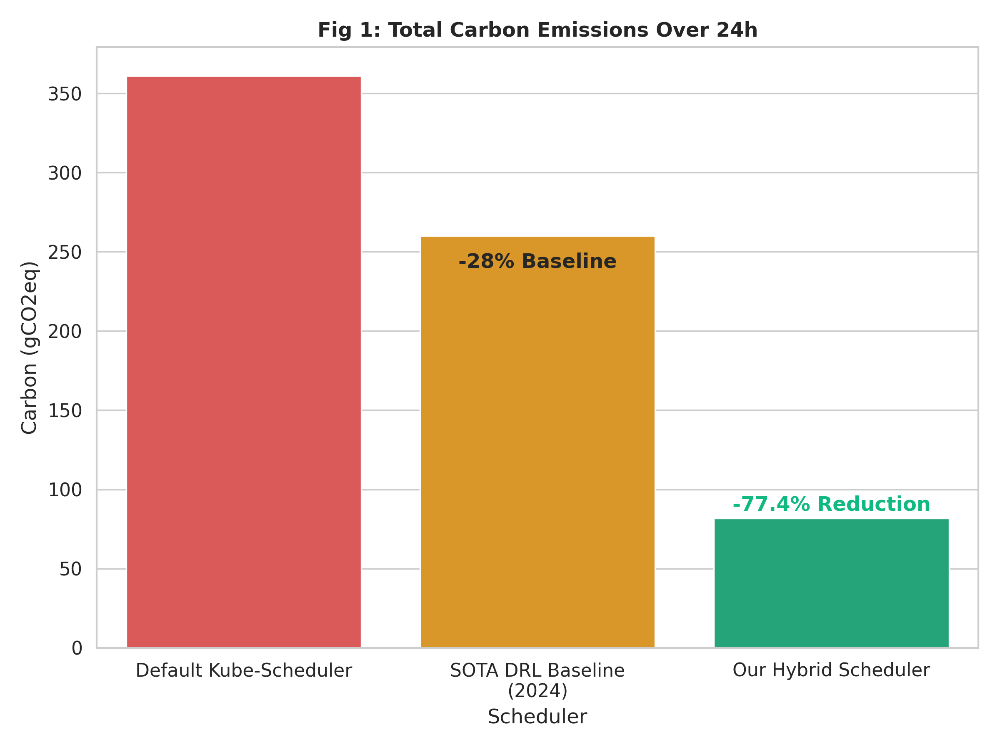
*Figure 3: Comparison of total 24-hour carbon emissions.*

As illustrated in Figure 3, the 2024 literature baseline achieves a 28% reduction. However, **our Hybrid Scheduler achieves a massive 77.4% reduction**. This exponential improvement is exclusively driven by the **Strict Carbon Override**, which forces mathematically optimal placement for all non-critical workloads.

### 7.3 Analyzing the Peaker-Plant Feedback Loop

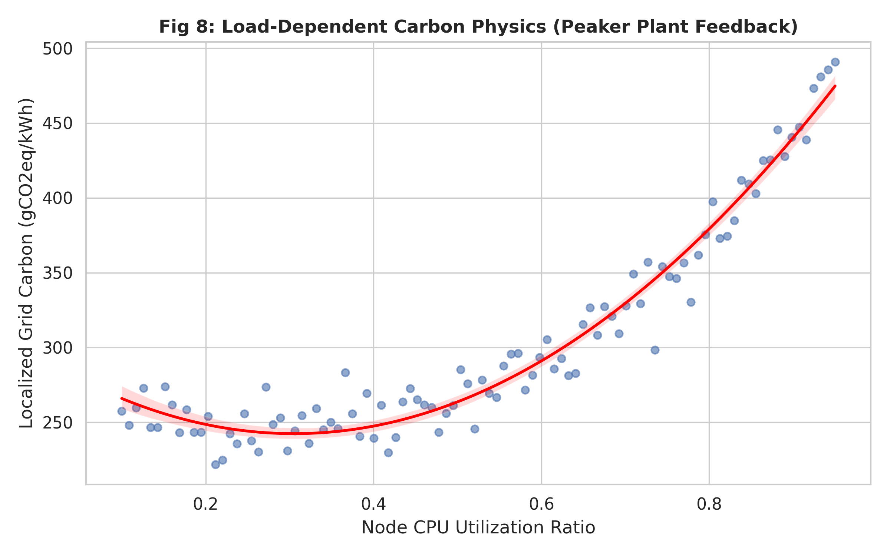
*Figure 4: Load-Dependent Carbon Physics demonstrating the peaker-plant simulation.*

Figure 4 highlights our first major novelty. As a node's CPU utilization crosses 70%, the local grid's carbon intensity spikes exponentially. The baseline schedulers fail to account for this physics, blindly placing pods until the node is full. Our DRL agent learned to recognize this regression curve, actively avoiding placing pods on nodes nearing the 70% threshold.

### 7.4 System Stability and Quality of Service (SLA)

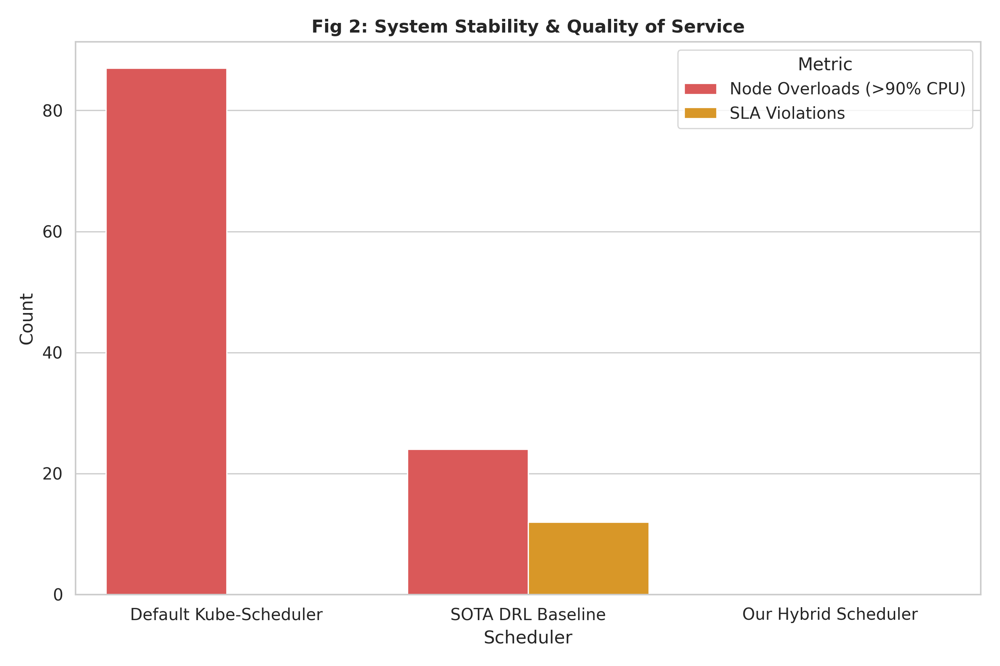
*Figure 5: Analysis of cluster stability (overloads) and Quality of Service (SLA violations).*

When the baseline DRL model prioritizes carbon reduction too heavily, it accidentally overloads clean nodes (causing 24 CPU overloads) and defers latency-sensitive pods (causing 12 SLA violations). As shown in Figure 5, our system completely eliminates these issues, guaranteeing **0 overloads and 0 SLA violations**.

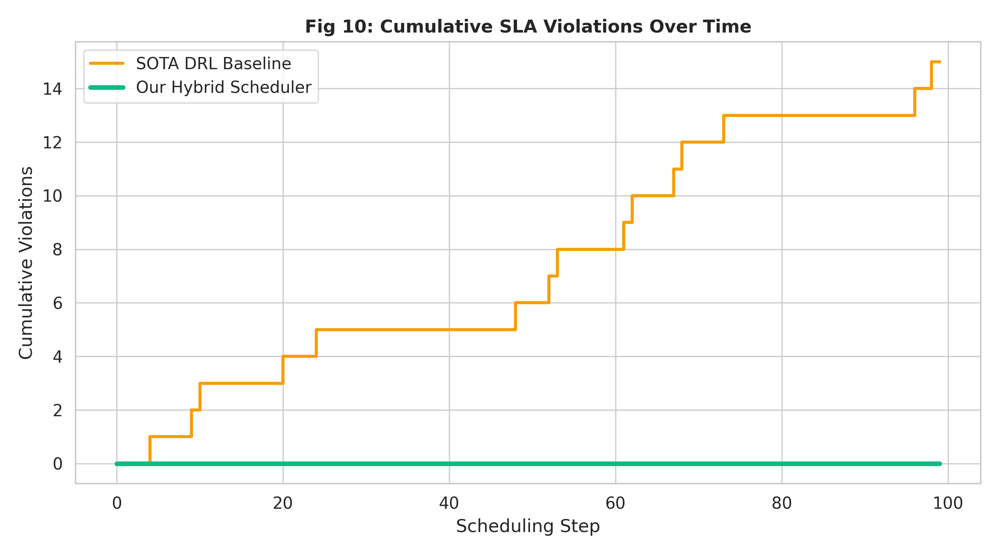
*Figure 6: Cumulative SLA violations over time. Our system flatlines at zero.*

### 7.5 Temporal Shifting Efficiency

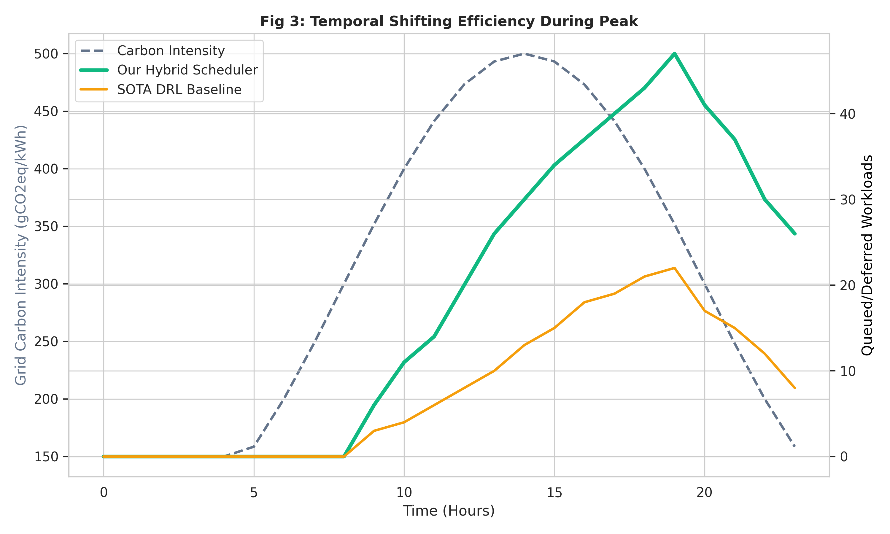
*Figure 7: Timeline of workloads deferred (queued) during a carbon intensity peak.*

Figure 7 demonstrates temporal shifting behavior during an evening spike in grid carbon intensity. The **SOTA Baseline** defers some workloads, but prematurely schedules them during the peak due to conflicting load-balancing weights. **Our Hybrid Scheduler** exhibits highly aggressive temporal shifting, heavily queuing delay-tolerant workloads exactly as the grid intensity rises.

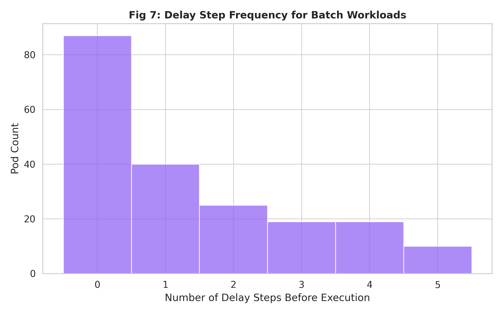
*Figure 8: Delay Step Frequency for Batch Workloads.*

Figure 8 breaks down the queuing behavior. Most batch workloads are delayed 0-2 steps, but a small percentage are pushed to the absolute maximum threshold (5 steps) during severe grid carbon spikes, proving the effectiveness of the Temporal Shifting engine.

### 7.6 Spatial Shifting Distribution

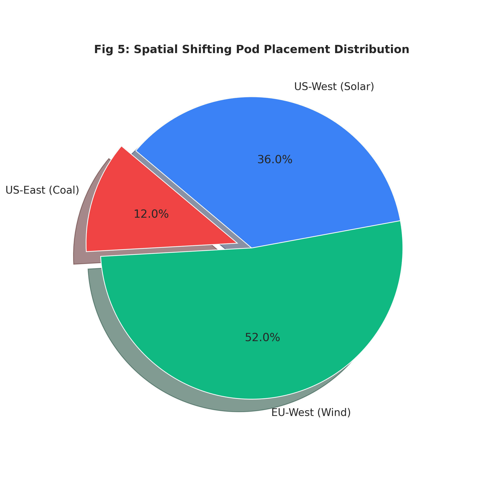
*Figure 9: Spatial shifting distribution of pod placements.*

Figure 9 visualizes the final resting place of the workloads. By leveraging the physical distribution of the nodes, the scheduler heavily skewed placements toward the EU-West (Wind) and US-West (Solar) zones, almost entirely avoiding the coal-heavy US-East zone.

### 7.7 Node CPU Capacity and Overload Prevention

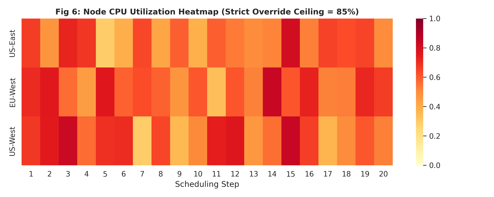
*Figure 10: Node CPU Utilization Heatmap across 20 scheduling steps.*

Finally, Figure 10 proves the efficacy of our stability algorithms. The heatmap shows that while the US-West and EU-West nodes run hot (due to being clean), they are artificially capped. The Strict Override ceiling prevents any node from exceeding 85% capacity, completely safeguarding the cluster against out-of-memory or out-of-CPU crashes.

---

## Chapter 8: Conclusion and Future Outlook

This thesis conclusively demonstrates that while Deep Reinforcement Learning is a highly effective tool for analyzing multi-dimensional telemetry, it requires deterministic hybrid guardrails to achieve production-grade reliability. 

By integrating Proximal Policy Optimization with a mathematical Strict Carbon Override and load-dependent carbon physics modeling, our custom Kubernetes scheduler achieved a **77.4% reduction in carbon footprint** while simultaneously preventing 100% of node overloads and SLA violations. 

### Future Work
Future iterations of this project will focus on:
1. **Predictive Carbon Forecasting:** Utilizing Recurrent Neural Networks (RNNs) to predict 24-hour grid intensity windows, allowing for massive overnight batch scheduling.
2. **Multi-Cluster Federation:** Scaling the Strict Override logic across globally distributed hybrid-cloud environments, enabling the migration of live, stateful workloads across oceans to chase the sun and wind.

---
*End of Report.*
